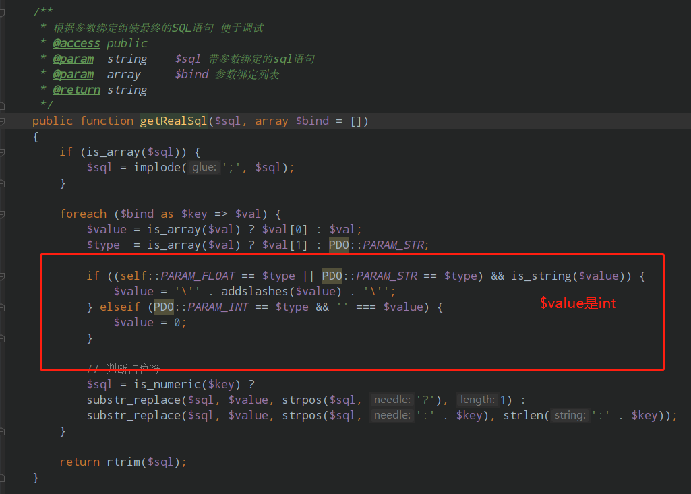
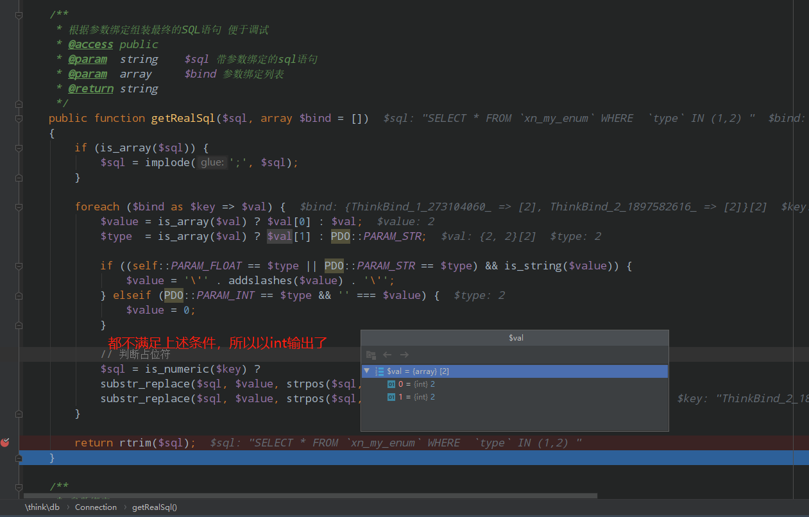
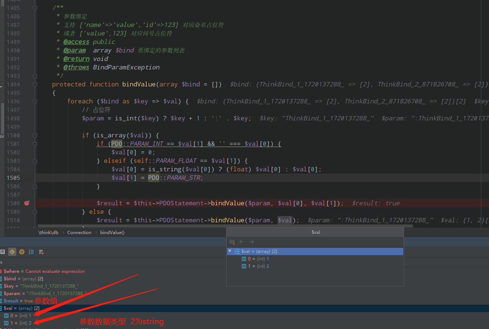
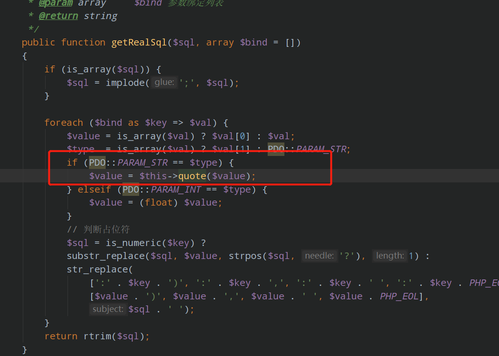

# 一条神奇的sql

github看不了图的话，麻烦移驾：https://gitee.com/slovty/php-notes/blob/master/eNotes/%E4%B8%80%E6%9D%A1%E7%A5%9E%E5%A5%87%E7%9A%84sql.md

个人有一个习惯，喜欢在查询的时候把sql也打印出来去数据库执行一下，看是否预期一致。
 就是这个习惯，让我发现一个"神奇"的现象：同一预期的sql通过不同的方法而得到出不同的结果集。

**本次问题环境**

 **mysql5.7 php7.3.4nts ThinkPHP5.1 redis5.0.5**
    
**出现的问题现象** 

   原先代码的本意是查出type（数据类型为enum）为2或者3的数据，因为涉及到工作，这里就用一个测试案例呐。
   可以通过下图看到，我们的本意是查出xn_my_enum表符合条件为type为1，2的数据集。但是呢，我拿到sql去数据库执行的
   结果，和tp的查询构造器方法获得的数据集不一样(⊙o⊙)？
   
   明显的，$list才是我们所预期的数据集 ，而$list2就。。。
   
   这是啥玩意啊，为啥type为“3”的也来了哈哈
   
   **使用tp的查询构造器方法和原生的query传sql方法获得的数据集不一致。**
   

**解决问题的过程**

首先查看表结构可以发现，type为enum类型，而且元素顺序为2，3，9，6；

那么我们知道枚举原理：**枚举在进行数据规范的时候（定义的时候），系统会自动建立一个数字与枚举元素的对应关系（关系放到日志中）；
然后在进行数据插入的时候，系统自动将字符转换成对应的数字存储，
然后在进行数据提取的时候，系统就自动将数字转换成字符串显示。**
        
那么数字与枚举元素的对应关系就是1-”2“，2-”3“，3-“9”，4-“6”；

咦，是不是与$list2的结果集一样的，哈哈，那么就可以知道如果参数传的是int的话，就会直接查enum
的数字。

出现这种情况，基本就是框架tp的锅了，或者说是代码不规范和数据库表设计不合理。

那么追一下tp的getLastSql()吧，最终如下图，通过层层解析后，然后通过getRealSql()
来获得我们看到的sql,关键的地方用红框了，$value是int,$type是2（代表数据类型为string，set，enum）
所以走不到if里面被处理加上单引号，自然的就以原有的int替换占位符了，所以得到了我们看到的sql。
   

那么tp的查询构造器是咋搞得呢，它走的另一个路子，通过PDO的操作实例的一个方法bindValue(),我们可以在下图看到
PDO实例调用的bindValue()接收3个参数，而$val[1]=2,所以值是会加上单引号的，得到了正确的结果集。

**解决方案**

1.把参数加上单引号，明白enum的原理；

2.不管它，反正框架帮你解决了。。。这显然不是啥好习惯。

**总结 || 一些唠叨**

用某个东西的时候，最好能理解其原理，这样用起来才能得心应手，不会出了点小问题就焦头烂额。

能追一下问题的根源是极好的，这个问题本来8月初就想记录下来了，苦于各种原因吧，哈哈，
把做的事写下来比做难多了。

这个问题出现的原因就是getRealSql()的原因，它在$type（参数数据类型）满足加单引号的条件时
没有加上，但是这个也是tp5.1版本的bug吧，tp5.0.24没这个问题

**可还原数据支持**

`CREATE TABLE `xn_my_enum` (
  `id` int(10) unsigned NOT NULL AUTO_INCREMENT COMMENT 'ID',
  `username` varchar(30) COLLATE utf8mb4_unicode_ci NOT NULL DEFAULT '' COMMENT '名字',
  `type` enum('2','3','9','6') COLLATE utf8mb4_unicode_ci NOT NULL DEFAULT '2' COMMENT 'type',
  `createtime` int(10) unsigned DEFAULT '0' COMMENT '时间',
  PRIMARY KEY (`id`)
) ENGINE=InnoDB AUTO_INCREMENT=1 DEFAULT CHARSET=utf8mb4 COLLATE=utf8mb4_unicode_ci COMMENT='神奇的sql测试表';
`

**_SELECT * FROM `xn_my_enum` WHERE  `type` IN (1,2);_**

INSERT into `xn_my_enum`(username,type) VALUES('VBA','2'),('VBA333','3'),('VBA6','6'),('VBA9','9');

github看不了图的话，麻烦移驾：https://gitee.com/slovty/php-notes/blob/master/eNotes/%E4%B8%80%E6%9D%A1%E7%A5%9E%E5%A5%87%E7%9A%84sql.md
